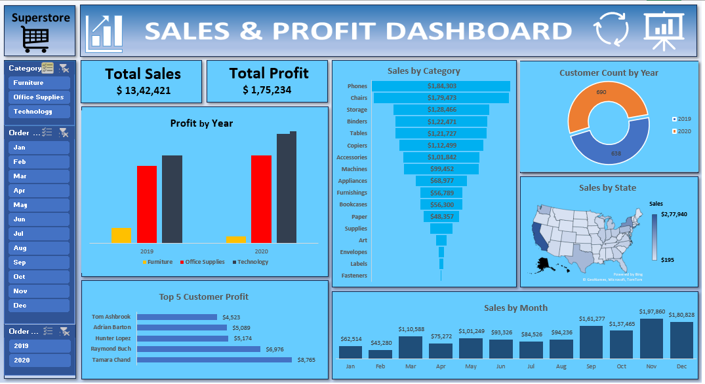

# Excel-sales-dashboard-superstore
- [Project Overview](https://github.com/Jk1201-web/Excel-sales-dashboard-superstore/blob/main/README.md#project-overview)
- [Dataset](https://github.com/Jk1201-web/Excel-sales-dashboard-superstore/blob/main/README.md#dataset)
- [Dataset Information](https://github.com/Jk1201-web/Excel-sales-dashboard-superstore/blob/main/README.md#the-dataset-contains-retail-sales-data-including)
- [Tools & Techniques used](https://github.com/Jk1201-web/Excel-sales-dashboard-superstore/blob/main/README.md#tools--techniques-used)
- [Dashboards](#dashboards)
- [Key insights](#key-insights)
- [Dashboards preview](#dashboards-preview)
- [Project outcome](#project-outcome)
- [Author](#author)
- 
## Project Overview
This project presents an interactive Sales & Profit Dashboard built in Microsoft Excel using the Superstore dataset. The dashboard helps analyze key business metrics such as sales performance, profit trends, customer profitability, and regional sales distribution.
The goal of this project is to transform raw sales data into meaningful insights using data visualization and Excel analytics tools.
## Dataset
The dataset used in this project can be found here:
[Click here to view dataset](https://www.kaggle.com/datasets/saadharoon27/superstore-dataset)

## The dataset contains retail sales data including:
- Order Date
- Sales
- Profit
- Product Category
- Customer Name
- State
- Order Year and Month
This data was used to analyze sales trends, customer performance, and product category contribution.
## Tools & Techniques Used
- Microsoft Excel
- Pivot Tables
- Pivot Charts
- Data Cleaning
- Data Aggregation
- Slicers for interactive filtering
- Dashboard Design
## Dashboard Features
The dashboard provides the following key insights:
- 1️⃣ KPI Metrics
Total Sales: $13.4M
Total Profit: $175K
- 2️⃣ Sales by Category
Shows which product categories generate the most revenue.
- 3️⃣ Profit by Year
Analyzes yearly profit performance across product categories.
- 4️⃣ Customer Count by Year
Displays the number of customers contributing to sales each year.
- 5️⃣ Sales by State
A geographic visualization highlighting sales distribution across states.
- 6️⃣ Top 5 Customer Profit
Identifies the most profitable customers.
- 7️⃣ Sales by Month
Shows monthly sales trends to identify peak sales periods.
## Key Insights
- 1) Technology products generate the highest profit contribution.
- 2) Sales show seasonal growth towards the end of the year.
- 3) A small group of customers contributes significantly to overall profit.
- 4) Certain states generate higher sales compared to others.
## Dashboard Preview

## Project Outcome
This project demonstrates the ability to:
- 1) Transform raw data into interactive dashboards
- 2) Perform data analysis using Excel
- 3) Create business insights using visualizations
## Author
Jijau Khandale
Aspiring Data Analyst

