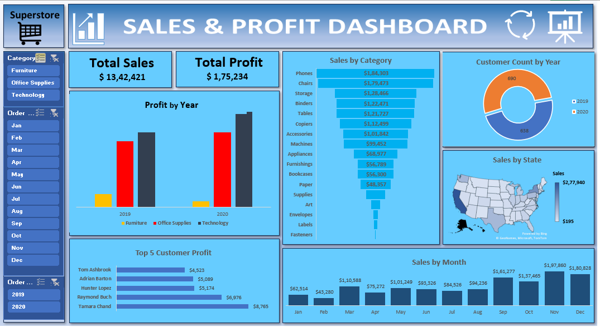

# Excel-sales-dashboard-superstore
- [Project Overview](https://github.com/Jk1201-web/Excel-sales-dashboard-superstore/blob/main/README.md#project-overview)
- [Objective](https://github.com/Jk1201-web/Excel-sales-dashboard-superstore#objectives)
- [Dataset](https://github.com/Jk1201-web/Excel-sales-dashboard-superstore#dataset)
- [Key Metrics](https://github.com/Jk1201-web/Excel-sales-dashboard-superstore#key-metrics)
- [Dashboard Features & Insights](https://github.com/Jk1201-web/Excel-sales-dashboard-superstore#dashboard-features--insights)
- [Key insights summary](https://github.com/Jk1201-web/Excel-sales-dashboard-superstore#key-insights-summary)
- [Business Recommendation](https://github.com/Jk1201-web/Excel-sales-dashboard-superstore#business-recommendations)
- [Tools & Skills used](https://github.com/Jk1201-web/Excel-sales-dashboard-superstore#tools--skills-used)
- [Dashboard Preview](https://github.com/Jk1201-web/Excel-sales-dashboard-superstore#dashboard-preview)
- [Project Workflow](https://github.com/Jk1201-web/Excel-sales-dashboard-superstore#project-workflow)
- [Project Structure](https://github.com/Jk1201-web/Excel-sales-dashboard-superstore#project-structure)
  
## Project Overview
This project presents an interactive **Sales & Profit Dashboard** built in Excel to analyze business performance across categories, customers, regions, and time.
The dashboard enables stakeholders to monitor key metrics, identify trends, and make data-driven decisions.
## Objectives
1. Analyze overall sales and profit performance
2. Identify top-performing categories and products
3. Evaluate customer contribution to profit
4. Understand regional and state-wise sales distribution
5. Analyze monthly and yearly sales trends

## Dataset
The dataset used in this project can be found here:
[Click here to view dataset](https://www.kaggle.com/datasets/saadharoon27/superstore-dataset)

## Key Metrics

| Metric |	Value |
|------|------|
| Total Sales |	$1,342,421 |
| Total Profit | $175,234 |
| Profit Margin |	~13% |
| Top Category | Technology |
| Max Monthly Sales |	~$97K |

## Dashboard Features & Insights
A. Sales & Profit Overview
1. **Total Sales** reached **$1.34M+**
2. **Total Profit** recorded at **$175K+**
3. **Profit margin** is approximately 13%
-  Insight: Business is profitable but has scope for margin improvement

B. Category-wise Sales
1. **Technology category dominates sales** **(~$184K+)**
2. Followed by Chairs, Storage, and Binders
-  Insight: Revenue is highly dependent on specific categories

C. Yearly Profit Analysis
1. Profit increased from 2019 to 2020
2. Technology segment shows strong growth
-  Insight: Business performance is improving year-over-year

D. Customer Analysis
1. Top customers contribute significantly to total profit
2. Example:
   - Tamara Chand → **~$8.7K**
   - Raymond Buch → **~$6.9K**
-  Insight: A few customers drive a large portion of profit

E. Regional & State-wise Sales
1. Sales vary widely across states
2. Range: **$195 to $27K+**
-  Insight: Some regions underperform and need attention

F. Monthly Sales Trend
1. Peak sales observed in November & December **(~$97K+)**
2. Lower sales in early months
-  Insight: Strong seasonality trend (year-end peak)

## Key Insights Summary
- Technology category drives majority of revenue
- Business shows positive growth trend year-over-year
- Sales peak during year-end months (Nov–Dec)
- Customer contribution is concentrated among top buyers
- Regional disparities exist in sales performance

## Business Recommendations
- Focus on expanding high-performing categories (Technology)
- Improve sales strategies in low-performing regions
- Target top customers with loyalty programs
- Plan inventory for seasonal demand spikes
- Optimize pricing to improve profit margins

## Tools & Skills Used
- Microsoft Excel
- Pivot Tables
- Data Visualization
- Dashboard Design
- Business Analysis
  
## Dashboard Preview



## How to Use
1. Open the Excel dashboard file
2. Use filters (Category, Year, Month)
3. Interact with charts for detailed insights
## Project Workflow
1. Data Collection
2. Data Cleaning
3. Data Transformation
4. Pivot Table Creation
5. Dashboard Design
6. Insight Generation

## Project Structure
```
Excel-Sales-Dashboard/
 ┣ Dataset/
 
 ┣ Dashboard/
 
 ┃ ┗ Sales_Dashboard.xlsx
 
 ┣ Images/
 ┃ ┗ dashboard.png
 
 ┗ README.md
```
Connect with Me
- [LinkedIn](www.linkedin.com/in/jijau-khandale)
- [GitHub](https://github.com/Jk1201-web)
- [Kaggle](https://www.kaggle.com/jijaumohankhandale)
  
*If you found this project useful, consider giving it a star!*


